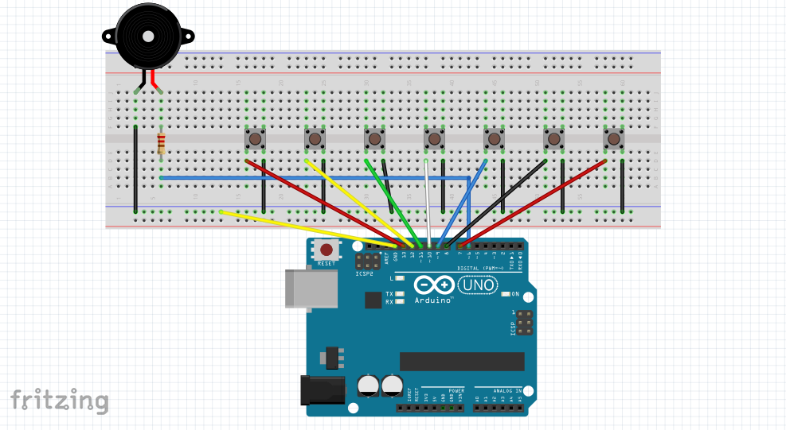
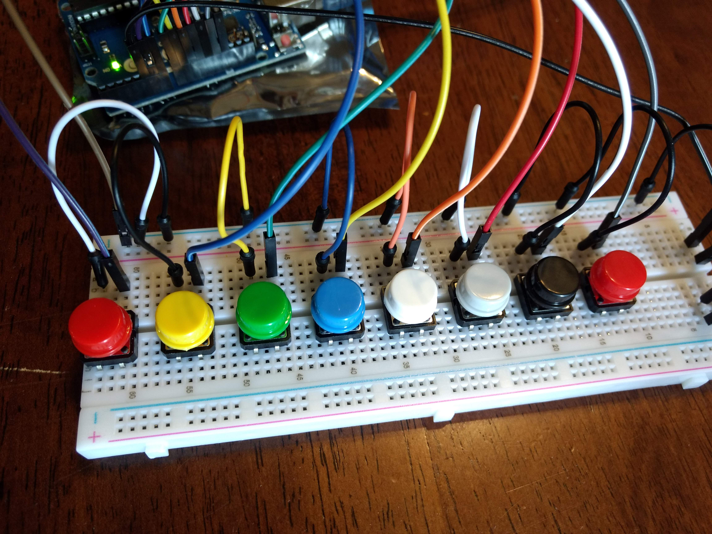
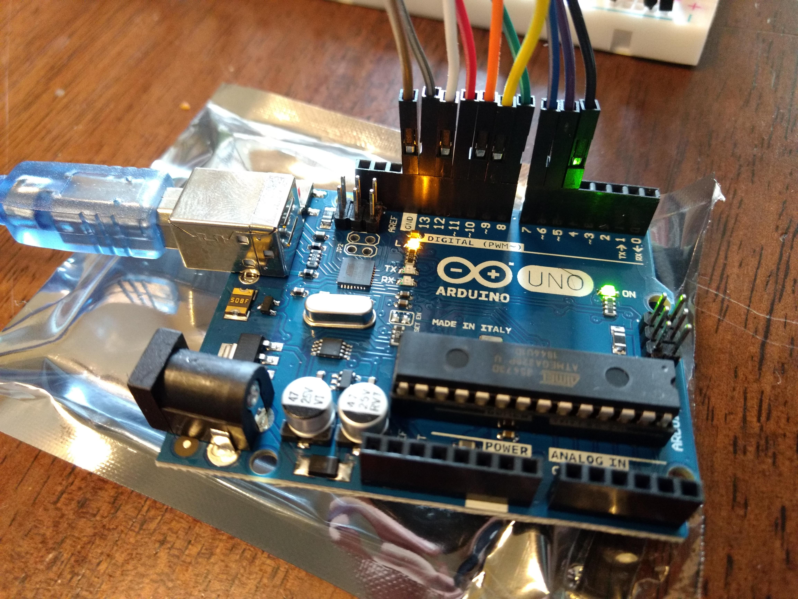
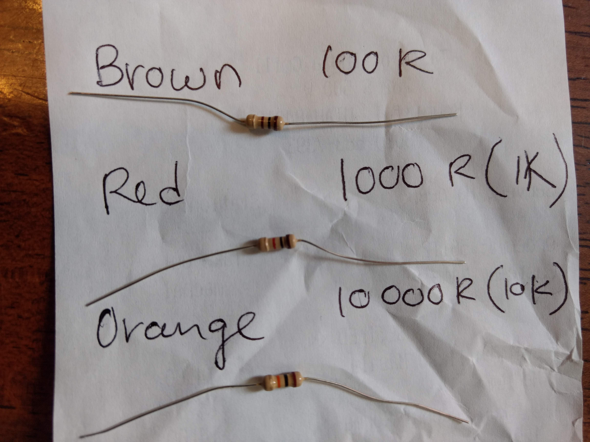
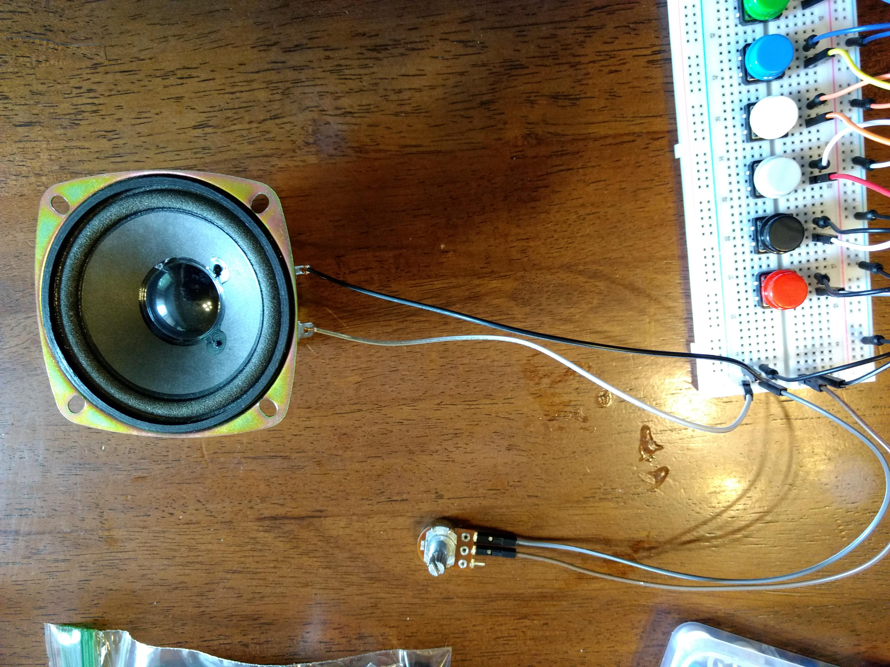
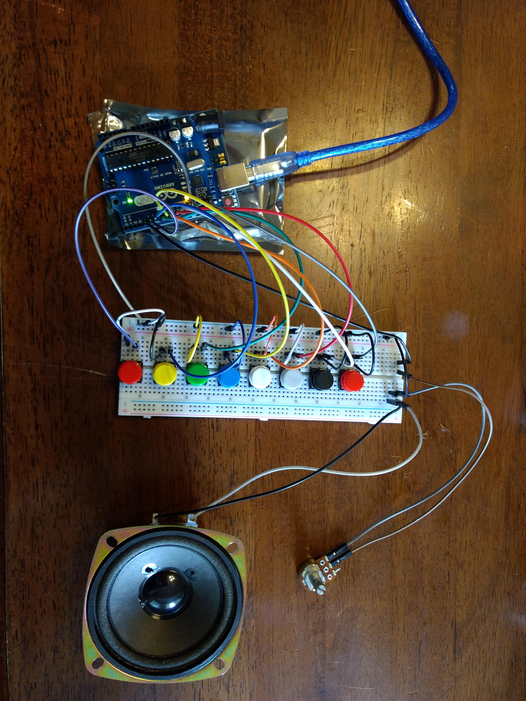

# Create Your Own Keyboard
This worksheet will walk you through putting together your very own keyboard. The project will be completed in two steps. First, assembly of the Arduino board and other electronics and second, programming the Arduino.  Let's start with assembling our keyboard.

Below are the supplies you'll need to complete the project:

* 1 - Arduino Uno
* 1 - Speaker
* 1 - 830 Point Solderless Breadboard 
* 10 - Long Male to Male Breadboard Wires
* 10 - Short Male to Male Breadboard Wires
* 4 - Long Male to Female Breadboard Wires
* 8 - Tactile Push Buttons and Colorful Caps
* 1 - 100R Resistor
* 1 - 1K Resistor
* 1 - 10K Resistor
* 1 - B50K Potentiometer
* 1 - Laptop with [Arduino IDE](https://www.arduino.cc/en/Main/Software) installed

## Assembling the Keyboard

The image below is a diagram of the completed first stage of our keyboard, however this keyboard only has 7 buttons. We'll be creating ours with 8 buttons or keys. 



### Step 1 - Placing the Buttons
1. Position your 8 buttons starting from left to right on your board. For now it doesn't matter much where exactly you place them, but I placed mine straddling the center channel starting at the left and then spaced them with 2 columns between each button.
2. Next, use the 8 short male to male wires to connect any point in the same column of the left most button pin.  Connect the other end to any point in the blue or (-) row as seen in the image below.
3. Connect any point in the blue or (-) row into the Arduino pin labelled "GND" using a long male to male wire.



4. Finally, use the long male to male wires to connect any point in the same column of the right most button pin to the Arduino pins labelled 13, 12, ~11, ~10, ~9, 8, 7, and ~6.  Make sure to note which button is connected to which Arduino pin, you'll need this when you create your program and tell it which button will play which note.



### Step 2 - Connecting the Speaker
1. Take 2 long male to female wires and cut off the female connector. Strip the wire so that about 1/2 inch is exposed. Twist the wires together in one direction and have an one of the older teens or adults help you solder these two wires to the posts of the speaker. Once the solder has hardened, connect the (-) post on the speaker to any point in a column on the far right.
2. Connect the (-) and (+) posts to any point in two separate columns on the bottom right of your breadboard.
3. Next, using a short male to male wire, connect any point in the row where the (-) post is connected to the blue or (-) row.
4. In a point from the same column as the wire coming from the (+) post on the speaker, connect the 10K resistor across the center channel into another point in that column. The 10K resistor is the one with the Gold-Orange-Black-Brown stripe combination. 



5. In any point of the same column of the 10K resistor, use a long male to male wire to connect to the Arduino pin labelled "~5" and once again take note of this number for the code. Your board should look similar to this one.



### Step 3 - Connect the Arduino to a computer or laptop.
1. Use the USB cable to connect the Arduino board to a laptop or computer this will provide power to your board and allow you to complete the coding step of this project.

If you completed these steps correcly, your keyboard should look something like this:



Don't worry that it doesn't look exactly the same, we'll make some tweaks after the coding portion of the project.


## Writing the program

### Step 1 - Download the Code
1. If you haven't already download the Arduino IDE onto your computer.
2. Make sure the Arduino is connected then click "Tools" > "Port" and select the COM port your Arduino is connected to. You'll likely only have one option here.
3. Now download the "keyboard" folder I've provided on this webpage onto your computer.
4. In the Arduino IDE click "File" > "Open" and select the `"keyboard.ino"` file in the location where you saved the keyboard folder.

### Step 2 - Include the `"pitches.h"` Library
In order to save us some complex coding, we're going to use some code that someone has already set up to generate tones or notes on our speaker. This is called the pitches library and I've included a copy in the "keyboard" folder.

1. Add a line of code at the top of your script to reference or call that library using the following syntax:
```
#include "fill-in-the-blank-here.h"
```
2. Make sure the `"pitches.h"` file is located in the same folder as your `"keyboard.ino"` file or this probably won't work.

### Step 3 - Program the Arduino Pins
Also near the top of the code you'll see some lines like this:
```
int C5 = ; //First button on pin _?
int D = ; //Second button on pin _?
int E = ; //Third button on pin _?
int F = ; //Fourth button on pin _?
int G = ; //Fifth button on pin _?
int A = ; //Sixth button on pin _?
int B = ; //Seventh button on pin _?
int C6 = ; //Eighth button on pin _?
```
1. Tweak this code to assign the proper Arduino Pin label that is connected to each button or key on your keyboard. "C5" should be the lowest note (or furthest left) and "C6" the highest. Although your welcome to code these in any order you want... :) Here's an example:
```
int E = 11;
```
Note: Even though the Arduino Pin is labelled "\~11", there is no need to inlude the "\~" character.

2. You'll notice there are several lines of code that contain a function like the one below. The `5` represents the Arduino pin label that is connected to your speaker. Make sure this matches the pin that is actually connected to the speaker.
```
tone(5, e[Note], duration);
```

### Step 4 - Push Your Code to the Arduino
1. Once you've completed the above steps, click the "Upload" button to push your code to the Arduino. You should see a success message at the bottom part of the Arduino IDE window.
2. Try out your keyboard. If it works correctly, you should hear some notes when you press the keys. Ask for help if you get any errors or if it's not working.


## Figuring Out Your New Keyboard
Congrats! You made it this far, but let's see if we can figure out how some of the components work.  You've probably noticed that you have a few extra parts, resistor.  Let's see what happens when we make some changes to the resistors on our board.

1. Play a few notes then replace the 10K resistor with the 1K resistor. Play a few more notes with the change.  Did you notice any difference?
2. Now replace the 1K resistor with the 100R resistor. Play a few notes. Did you pick up on the change this time?  How do you think the different resistors affected your keyboard? As for resistors the higher the number 10K (a.k.a. 10,000R) versus the lower 100R will have greater resistance to the electrical flow.
3. Now replace the 100R resistor with a short male to male wire. What happened?
4. Finally, take the Potentiometer (the thing that looks like a dial with 3 connecting posts) and use two long male to female connecters to replace the resistor or short wire from above. Instead of connecting the two points direcly together, connect one end to the center post of the Potentiometer and the to one of the two side posts of the Potentiometer.
5. While someone plays a few notes, twist the dial on the Potentiometer and see what happens. What do you think causes the notes to change when you twist the dial?  How is this similar to what we did in 1-3 above?

Congrats and well done on completing this project! I hope you've enjoyed this project as much as I did!  If it's not working the way you expected, ask for some help.

**Extra Credit**:  Can you program your buttons to do more than just play a single note?  Why not just program 8 of your favorite songs to play when you push each button?

